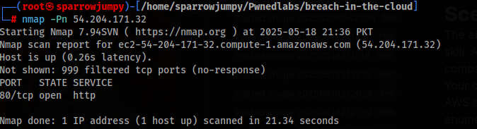
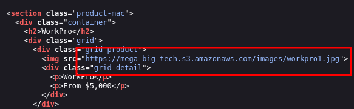

# Scenario
The ability to expose and leverage even the smallest oversights is a coveted skill. A global Logistics Company has reached out to our cybersecurity company for assistance and have provided the IP address of their website. Your objective? Start the engagement and use this IP address to identify their AWS account ID via a public S3 bucket so we can commence the process of enumeration.

ip address: 54.204.171.32
Access key id: **REDACTED_FOR_LAB**
Secret access key: **REDACTED_FOR_LAB** 

Performed nmap on the target ip which showed http open:

Went to the page and the page source showed mega-big-tech as the s3 bucket.

The access credentials provided to us our only for checking ID of the S3 bucket (target), it is not our target but we can either use it or our personal account. 

I configured the aws account provided: aws configure --profile pwnedidlab

To find ID of the I used the tool: https://github.com/WeAreCloudar/s3-account-search/tree/main

This tool tried to brute-force discover the AWS Account ID of the owner of the mega-big-tech S3 bucket — using the role I specified: s3-account-search arn:aws:iam::427648302155:role/LeakyBucket mega-big-tech (the role was provided to us by PwnedLabs)

💡 How it works (in simple terms):
- It uses the role ARN you gave (like a fake identity badge) to try accessing the S3 bucket.
- It modifies the ARN slightly by replacing the AWS Account ID digit by digit, and sends requests to the bucket.
- Each time it finds a match (access isn't immediately denied), it keeps the digit and adds the next one, narrowing down the correct account ID.
- It keeps going until it finds the full 12-digit AWS account ID that owns or is trusted by the bucket.

Id was found using it which is our flag!
