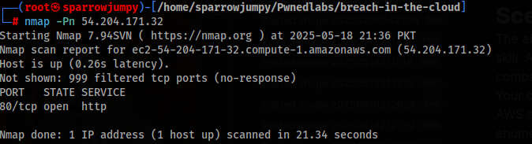
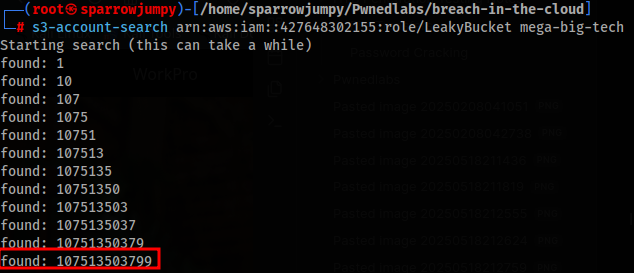

#_Scenario
The_ability_to_expose_and_leverage_even_the_smallest_oversights_is_a_coveted_skill._A_global_Logistics_Company_has_reached_out_to_our_cybersecurity_company_for_assistance_and_have_provided_the_IP_address_of_their_website._Your_objective?_Start_the_engagement_and_use_this_IP_address_to_identify_their_AWS_account_ID_via_a_public_S3_bucket_so_we_can_commence_the_process_of_enumeration.

ip_address:_54.204.171.32
Access_key_id:_**REDACTED_FOR_LAB**
Secret_access_key:_**REDACTED_FOR_LAB**_

Performed_nmap_on_the_target_ip_which_showed_http_open:

Went_to_the_page_and_the_page_source_showed_mega-big-tech_as_the_s3_bucket.

The_access_credentials_provided_to_us_our_only_for_checking_ID_of_the_S3_bucket_(target),_it_is_not_our_target_but_we_can_either_use_it_or_our_personal_account._

I_configured_the_aws_account_provided:_aws_configure_--profile_pwnedidlab

To_find_ID_of_the_I_used_the_tool:_https://github.com/WeAreCloudar/s3-account-search/tree/main

This_tool_tried_to_brute-force_discover_the_AWS_Account_ID_of_the_owner_of_the_mega-big-tech_S3_bucket_—_using_the_role_I_specified:_s3-account-search_arn:aws:iam::427648302155:role/LeakyBucket_mega-big-tech_(the_role_was_provided_to_us_by_PwnedLabs)

💡_How_it_works_(in_simple_terms):
-_It_uses_the_role_ARN_you_gave_(like_a_fake_identity_badge)_to_try_accessing_the_S3_bucket.
-_It_modifies_the_ARN_slightly_by_replacing_the_AWS_Account_ID_digit_by_digit,_and_sends_requests_to_the_bucket.
-_Each_time_it_finds_a_match_(access_isn't_immediately_denied),_it_keeps_the_digit_and_adds_the_next_one,_narrowing_down_the_correct_account_ID.
-_It_keeps_going_until_it_finds_the_full_12-digit_AWS_account_ID_that_owns_or_is_trusted_by_the_bucket.

Id_was_found_using_it_which_is_our_flag!
